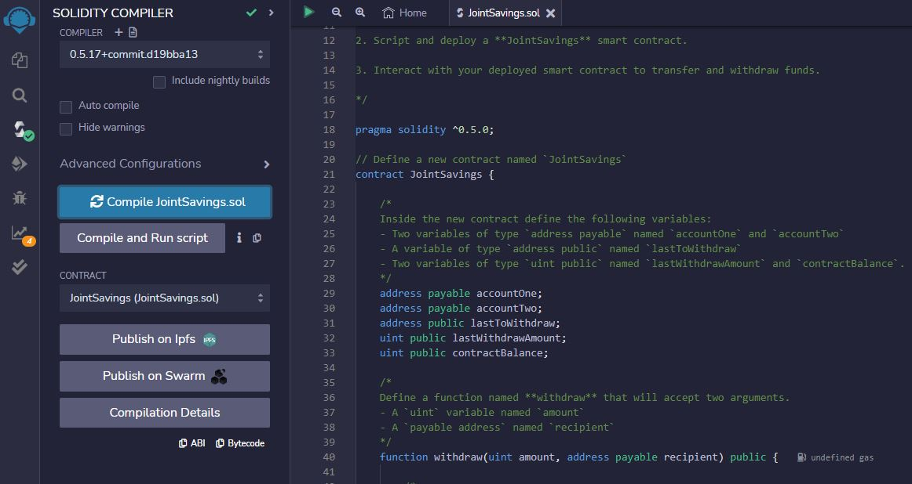
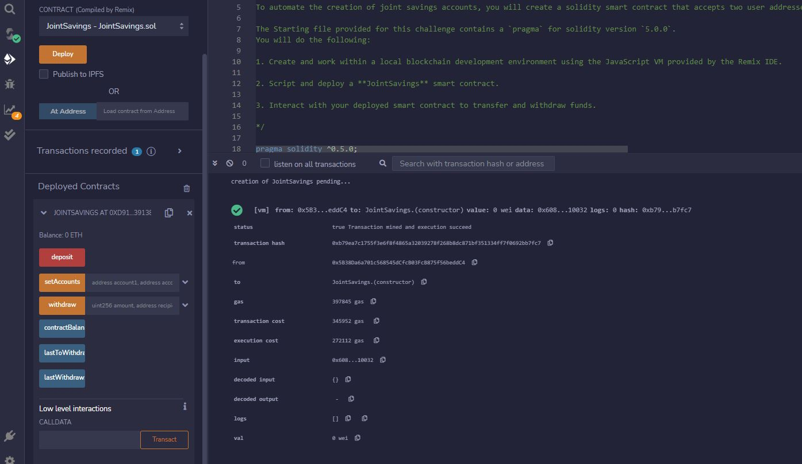
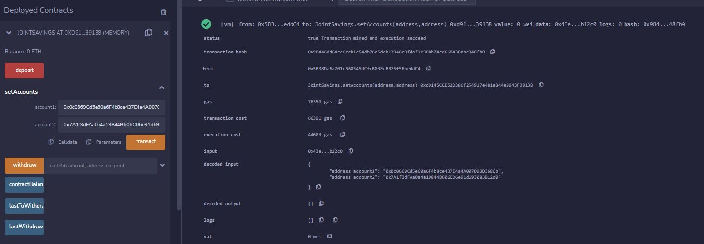

# Joint Savings Account Smart Contract

### Joint Savings Account automates the creation of joint savings accounts. It is a Solidity smart contract that accepts two user addresses. These addresses control a joint savings account. Joint Savings Account Smart Contract uses ether management functions to implement a financial institution’s requirements for providing the the joint savings account specific features. These features consist of the ability to deposit and withdraw funds from the account.

---

---

## Table of contents

1. [Technologies](#technologies)
2. [Usage](#usage)
3. [Contributors](#contributors)
4. [License](#license)

---

## Technologies

`Solidity`

_Libraries_

1. We use the `Remix IDE` to build and test the Joint Savings Account Smart Contract created with `Solidity`. Because we use the web version of this IDE, we don’t need to install any software for this module

   - [Remix IDE](https://remix.ethereum.org/) - to initate the application.

---

## Usage

> Application summary 

The application consists of the sections specified below: 

- Creating a JointSavings smart contract in Solidity: 

  - A set of variables defined inside the contract. 
  - The following functions are included:

    1.  Withdraw function;
    2.  Deposit function;
    3.  SetAccounts function;
    4.  A Fallback function to ensure the contract can store ether that’s sent from outside the deposit function. 

- Compiling and Deploying the Contract: 

  - Once the smart contract is written, we compile it and make sure there are no errors occur in our code (the compilation is accompanied by a green check sign): 
     
  - We click the Deploy button to deploy our smart contract, and then confirm that it successfully deployed: 
     

- Interacting with the Deployed Smart Contract: 

  - After deploying the contract the following functionalities were tested: 

    1. The setAccounts function used to define the authorized Ethereum address that will be able to withdraw funds from the contract:
        

    2. Test the deposit functionality of your smart contract by sending the following amounts of ether. After each transaction, use the contractBalance function to verify that the funds were added to your contract::
        

- Viewing the transaction on the Ganache interface: 
  When in Ganache, the user can: 

  1. Check the remainng balance on their address: 
      
  2. View the block in which the transaction is included - the address of the user and the selected employee, as well as the transfered amount in wei can be verified:: 
      

  3. Similar information will be visible on the transaction itself: 
      
  4. Finally, when selecting the employee's address on the Transaction above, the adress' balance can be seen too: 
      

View the interface and an example of the process of sending ETH: 

> Getting started 

- To use Cryptocurrency Payments Solution first clone the repository to your PC. 
- Use `streamlit run fintech_finder.py` as per the instructions in the [Installation Guide](#installation-guide) to run the application. 

---

## Contributors

Contact Details:

Boris Dudkin:

- [Email](boris.dudkin@gmail.com)
- [LinkedIn](www.linkedin.com/in/Boris-Dudkin)

---

## License

MIT

---
